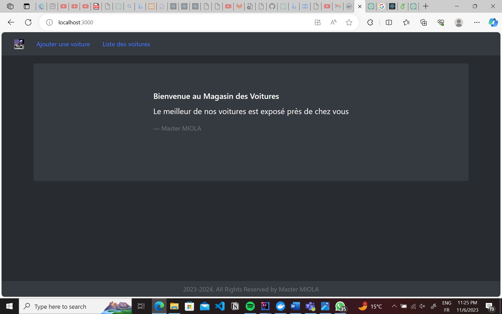
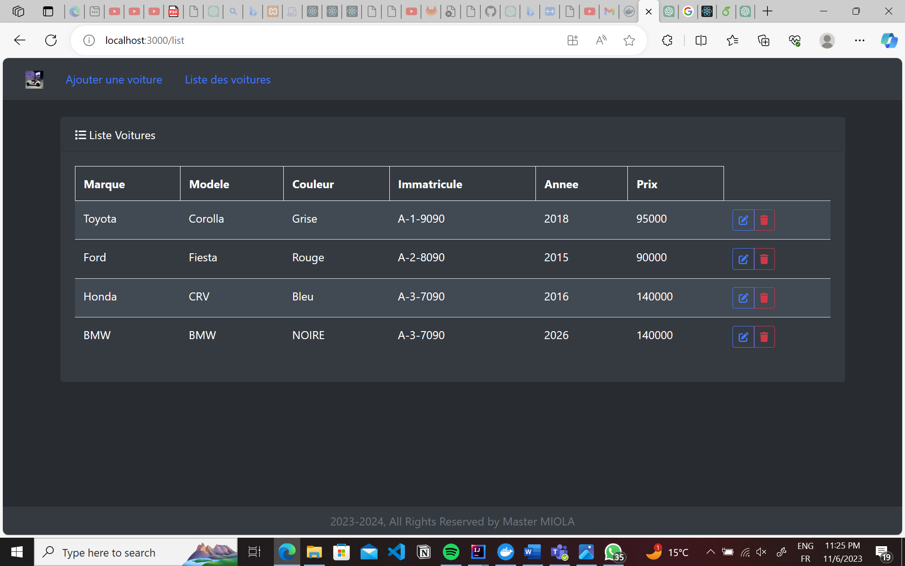
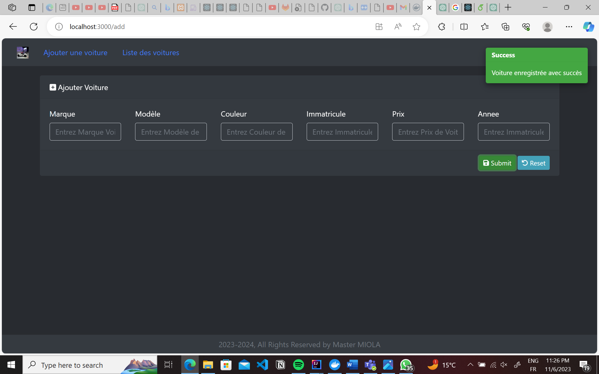
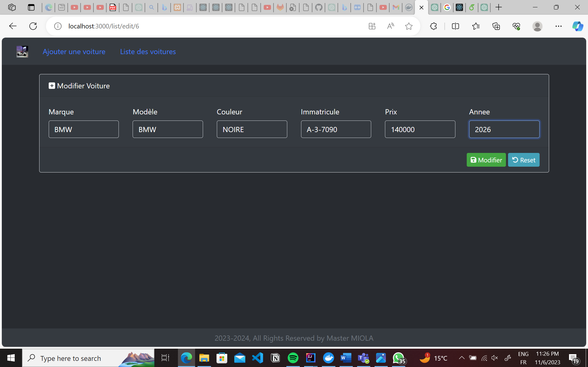
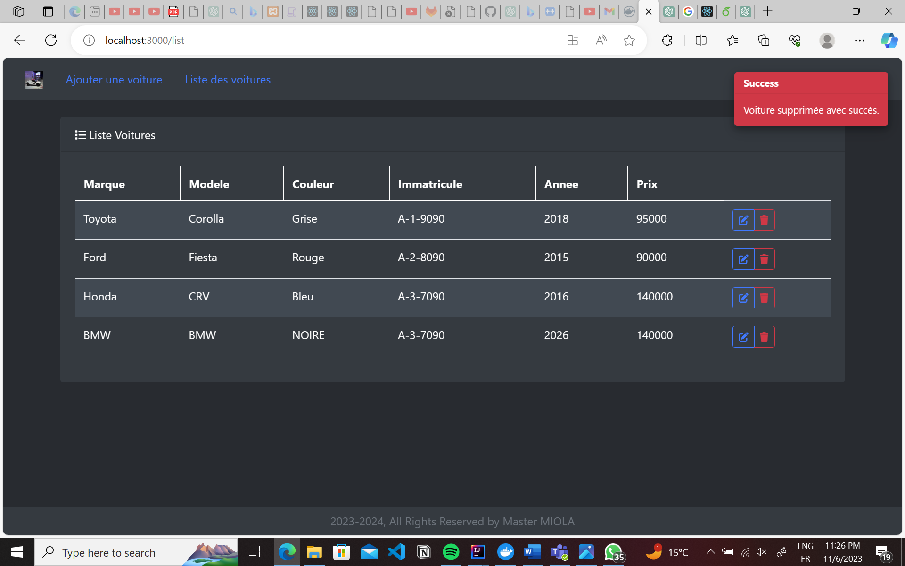

# Cars-Crud-Springboot
This project is a car Management System, a robust and user-friendly solution designed to revolutionize the way you handle car-related data. This project implements CRUD operations, allowing users to seamlessly Create, Read, Update, and Delete information about vehicles. With an intuitive interface, users can effortlessly add new cars, retrieve specific details, update information as needed, and remove outdated entries. 

## Table of Contents
* [General Information](#general-information)
* [Setup](#setup)
* [Screenshots](#screenshots)

## General Information
### Architecture of the project
The Model-View-Controller (MVC) architectural pattern is employed in our project to enhance the organization and maintainability of the codebase. This design pattern divides the application into three interconnected components:

- Model: Represents the data and business logic of the application. It encapsulates the application's state and ensures that any changes to the data trigger appropriate responses.
- View: Responsible for presenting the data to the users. It displays information from the Model and communicates user inputs back to the Controller. Views are designed to be modular and independent of the underlying application logic.
- Controller: Acts as an intermediary between the Model and View components. It processes user input from the View, updates the Model accordingly, and triggers the appropriate changes in the View. The Controller essentially manages the flow of data and ensures the separation of concerns.

### Containerization of the project
The containerization of our project has been streamlined and simplified through the use of a Docker Compose file, which orchestrates the deployment of three Docker containers. 
- One for the MySQL database.
- Another for the Spring Boot application.
- A third for the React frontend. Interconnected within the app-network. The mysqldb service initializes a MySQL container with specific configurations, such as
It's noteworthy that all the Docker images utilized in our project are hosted on Docker Hub under the account **"kawtar001"** This centralized repository ensures easy accessibility and retrieval of the necessary container images for the MySQL, Spring Boot, and React components.

### Technologies Used

## Setup
### Pre-Requisites
To set up this project you should install the following:
- Docker

### Usage

To effortlessly access and launch the project:
- Simply extract the Docker Compose file from the GitHub repository.
- Execute the command **'docker-compose up'** in the terminal within the project directory.
- Navigate to **http://localhost:3000/** in your web browser and here is the project ready to be used.

## Screenshots
### Home Page

### Cars list

### Add Car

### Edit car

### Delete car

